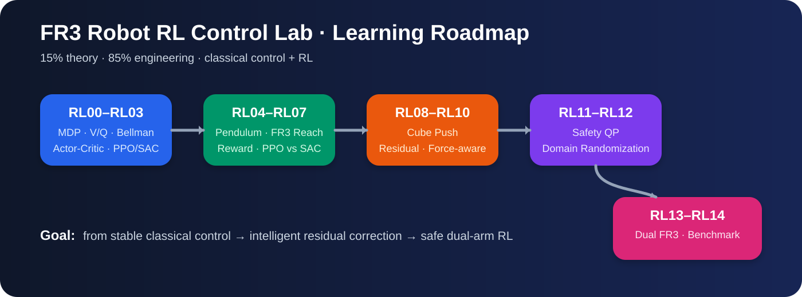
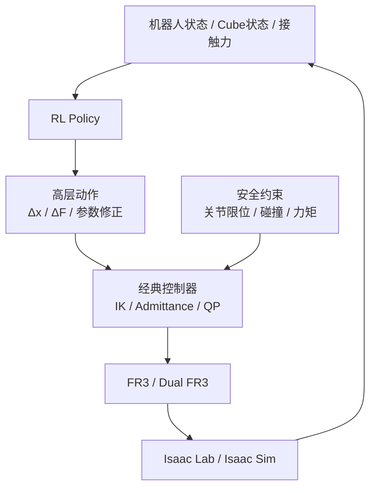
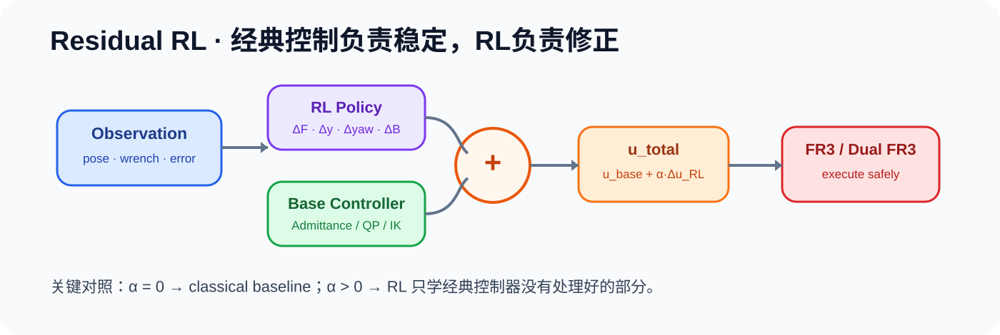
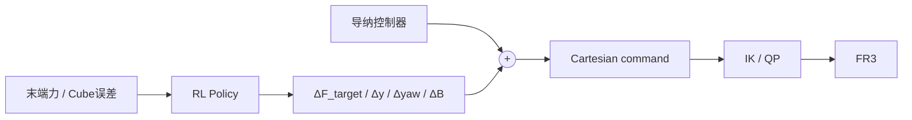

# 🤖 FR3 Robot RL Control Lab

> **少量基础 + 大量工程**：从 MDP / Actor-Critic 出发，尽快进入 FR3 连续控制、接触操作、Residual RL、安全约束与双臂协调。

本仓库不是“从头抄一遍强化学习教材”，而是一个面向机器人运控的 **工程化 RL 学习与实验仓库**。目标是把传统控制基础（Jacobian、操作空间、阻抗/导纳、QP、力位混合）与强化学习连接起来，最终形成可复现的 FR3 单臂/双臂控制实验。



---

## 🗺️ 一张图看路线

```mermaid
flowchart LR
    A[RL00<br/>MDP与RL语言] --> B[RL01<br/>Value / Q / Bellman]
    B --> C[RL02<br/>Policy Gradient / Actor-Critic]
    C --> D[RL03<br/>PPO + SAC]
    D --> E[RL04<br/>Pendulum连续控制]
    E --> F[RL05<br/>FR3 Reach]
    F --> G[RL06<br/>Reward Engineering]
    G --> H[RL07<br/>PPO vs SAC]
    H --> I[RL08<br/>Cube Push]
    I --> J[RL09<br/>Residual RL]
    J --> K[RL10<br/>Force-aware RL]
    K --> L[RL11<br/>Safety Filter / QP]
    L --> M[RL12<br/>Domain Randomization]
    M --> N[RL13<br/>Dual-FR3 RL]
    N --> O[RL14<br/>Unified Benchmark]
```



### 🎯 最终目标



---

## 🧠 学习原则

1. **先理解，不先背算法。** 前四个 Task 只学习真正影响机器人 RL 的概念。
2. **尽早进入工程。** 从 RL04 开始，每个 Task 都必须有可运行环境、训练曲线、评估结果和失败分析。
3. **先高层动作，再直接力矩。** 初期优先让策略输出 `Δx / Δv / controller parameters`，不要直接输出 7/14 维 torque。
4. **经典控制不丢。** RL 负责决策、修正或参数调节；IK、导纳、QP 等继续负责稳定执行。
5. **实验必须可复现。** observation、action、reward、seed、训练步数、网络、超参数、checkpoint、结果全部记录。
6. **Reward 不是魔法。** 每次 reward 修改都必须说明它希望改变什么行为，并做消融验证。
7. **成功率之外还看控制质量。** 必须关注 smoothness、force peak、action saturation、collision、energy、generalization。

---

## 🧩 Residual RL 在本项目中的位置

Residual = **残差 / 修正量**。



经典控制器先给出基础动作：

```text
u_base = 传统控制器输出
```

RL 只学习修正：

```text
u = u_base + Δu_RL
```

例如 Cube 推槽：



这样可以把“稳定执行”和“智能修正”分开，是本仓库后半程的重点。

---

## 📚 Task 总览

| 阶段 | Task | 主题 | 主要产物 |
|---|---|---|---|
| 基础 | RL00 | MDP 与机器人 RL 建模 | MDP card |
| 基础 | RL01 | V / Q / Bellman | 小型数值实验 |
| 基础 | RL02 | Policy Gradient / Actor-Critic | 手写最小实现 |
| 基础 | RL03 | PPO / SAC 必要机制 | 算法对照笔记 |
| 工程 | RL04 | Pendulum 连续控制 | PPO/SAC 训练流水线 |
| 工程 | RL05 | FR3 Reach | 第一套 FR3 RL 环境 |
| 工程 | RL06 | Reward Engineering | reward 消融 |
| 工程 | RL07 | PPO vs SAC | 公平对比 |
| 接触 | RL08 | Cube Push | 接触型 RL baseline |
| 接触 | RL09 | Residual RL | 经典控制 + RL |
| 接触 | RL10 | Force-aware RL | 力反馈 observation |
| 安全 | RL11 | Safety Filter / QP | 安全约束层 |
| 泛化 | RL12 | Domain Randomization | 鲁棒性实验 |
| 双臂 | RL13 | Dual-FR3 RL | 高层双臂策略 |
| 评测 | RL14 | Unified Benchmark | classical vs RL vs residual |

完整要求见 [`docs/tasks/`](docs/tasks/) 与 [`docs/ROADMAP.md`](docs/ROADMAP.md)。

---

## 🗂️ 仓库结构

```text
fr3-robot-rl-control-lab/
├── README.md
├── AGENTS.md
├── CODEX_START_HERE.md
├── pyproject.toml
├── docs/
│   ├── ROADMAP.md
│   ├── RL_CONCEPTS.md
│   ├── EXPERIMENT_PROTOCOL.md
│   ├── ENGINEERING_RULES.md
│   ├── STATUS.md
│   ├── WORKLOG.md
│   └── tasks/RL00...RL14
├── envs/             # Gym/Isaac Lab 环境
├── rl_core/          # algorithm adapters / buffers / utilities
├── controllers/      # IK / admittance / QP / residual wrappers
├── configs/          # environment / algorithm / reward yaml
├── benchmarks/       # fixed evaluation suites
├── scripts/          # train / eval / plot / smoke-test
├── tests/
├── assets/           # README 图、训练曲线、场景截图
└── results/          # 每次实验的结构化结果（大文件默认不入 git）
```

---

## 🧪 每次实验必须回答 7 个问题

> **1. Observation 是什么？**  
> **2. Action 是什么？**  
> **3. Reward 为什么这样设计？**  
> **4. Episode 何时结束？**  
> **5. Policy 训练时看到了哪些随机化？**  
> **6. 与哪个 baseline 公平比较？**  
> **7. 失败到底是算法问题、控制问题，还是仿真问题？**

---

## 📈 结果目录约定

```text
results/<date>_<task>_<run-id>/
├── metadata.yaml
├── config.yaml
├── train_metrics.csv
├── eval_metrics.json
├── stdout.log
├── checkpoints/
├── plots/
└── videos/
```

训练完成后 README 会逐步补充真实 FR3 场景截图、reward 曲线、成功/失败 GIF，让仓库既能教学也能展示研究过程。

---

## 🚦当前状态

**当前入口：RL00 — MDP & Robot RL Formulation**

先完成 RL00–RL03 的必要基础，然后立即进入 RL04 工程训练。不要在理论阶段无限扩展。
