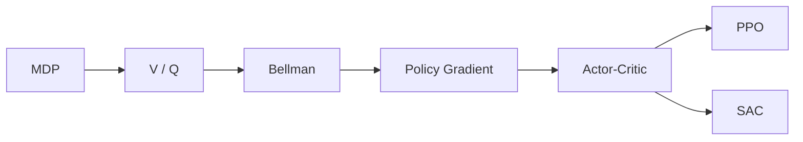

# RL Learning Roadmap

## Phase A — 必要基础（RL00–RL03）

## Phase B — 连续控制工程（RL04–RL07）
先在 Pendulum 跑通完整训练栈，再进入 FR3 Reach，并系统学习 reward、normalization、action scaling、PPO/SAC 对比。

## Phase C — 接触型机器人 RL（RL08–RL10）
从 Cube Push baseline 开始，进入 Residual RL 与 force-aware policy。重点是成功率、接触峰值、平滑性和鲁棒性。

## Phase D — 安全与泛化（RL11–RL12）
把 QP / safety filter 接到策略后面，再做 domain randomization。

## Phase E — 双臂与统一评测（RL13–RL14）
双臂第一版仍采用高层 action，不直接输出 14DoF torque。最终对比 classical / pure RL / residual RL。

## 建议时间节奏
若每周 10–15 小时：
- RL00–RL03：约 1–2 周；
- RL04–RL07：约 2–4 周；
- RL08–RL10：约 3–6 周；
- RL11–RL14：约 1–3 个月。

时间只作为学习节奏，不作为 PASS 标准。
